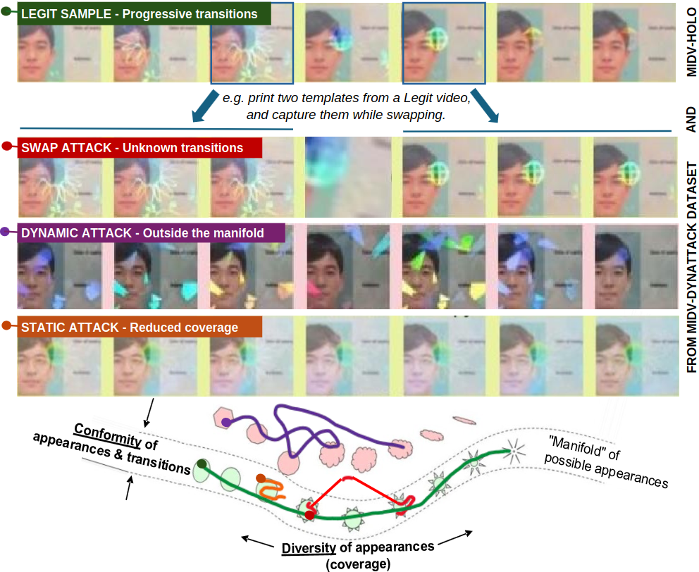

# Temporal Modeling of Optically Variable Devices in Identity Documents

Repository for the paper "[Temporal Modeling of Optically Variable Devices in Identity Documents](https://doi.org/10.1007/978-3-032-36023-6_6)" accepted at ICDAR 2026.



---

## Repository Structure

- `prevsota/`: Previous state-of-the-art baselines
- `sequenceclassif/`: Sequence classification experiments
- `msm/`: Masked Sequence Modeling experiments
- `scripts/results/`: Helpers to gather final results

---

## Installation

```bash
# HoloVerif Span
pip install -r sequenceclassif/requirements.txt

# Masked Sequence Modeling
pip install -r msm/requirements.txt
```

## Data

Download MIDV-Holo and MIDV-DynAttack from [Zenodo](https://zenodo.org/records/17079529).

---

## Experiments

### 1. Baselines (Previous SOTA)

Train using the [pouliquen.25.icdar](https://github.com/EPITAResearchLab/pouliquen.25.icdar) repository. Config files for this paper's evaluation protocol are in `prevsota/conf/` and modified test file `prevsota/test.py`.

### 2. HoloVerif Span: Sequence Classification

1. Place rectified document sequences in `sequenceclassif/rectified/` (extracted from `videos` at 15 fps using `tracking` information).
2. Generate the augmentation file:
   ```bash
   # 1. Download .npy files at https://github.com/googlecreativelab/quickdraw-dataset
   # 2. Set the input path in sequenceclassif/script/generate_quickdraw_ovd.py
   cd sequenceclassif
   python script/generate_quickdraw_ovd.py
   # Output: sequenceclassif/quickdraw_subsamples_more.pt
   ```
3. Run:
   ```bash
   cd sequenceclassif
   bash jobs/main.sh
   ```

### 3. Masked Sequence Modeling

1. After training a projector with the baselines repo, create `msm/configs/onlyorigins/data.txt`:
   ```
   fold_name  projector_model_path
   k0         path/to/modelk0
   k1         path/to/modelk1
   ...
   ```
2. Set dataset paths in `msm/configs/onlyorigins/onlyoriginswsl.yaml`, then generate per-fold configs:
   ```bash
   cd msm/configs/onlyorigins
   ./generate_configs.sh data.txt onlyoriginswsl.yaml
   ```
3. Run (results written to `msm/logs/`):
   ```bash
   cd msm
   bash jobs/main.sh
   ```

> **Note:** Ensure WSL model paths and dataset paths are correctly set in the config files before launching.

---

## Results & Visualization

After all experiments, set the paths in each script, then run:

```bash
python scripts/results/plot_roc.py              # ROC curves
python scripts/results/compare_methods_full.py  # full comparison table
python scripts/results/export_latex.py          # Table 2 (LaTeX export)
```

---

## Citation

```bibtex
@inproceedings{pouliquen_ovdtemporal_2026,
  title     = {Temporal Modeling of Optically Variable Devices in Identity Documents},
  author    = {Pouliquen, Glen and Chazalon, Joseph and Chiron, Guillaume and
               Terrades, Oriol Ramos and G{\'e}raud, Thierry and Awal, Ahmad Montaser},
  booktitle = {Proceedings of the 20th International Conference on
               Document Analysis and Recognition (ICDAR)},
  pages     = {92--108},
  doi       = {10.1007/978-3-032-36023-6_6},
  year      = {2026}
}
```
